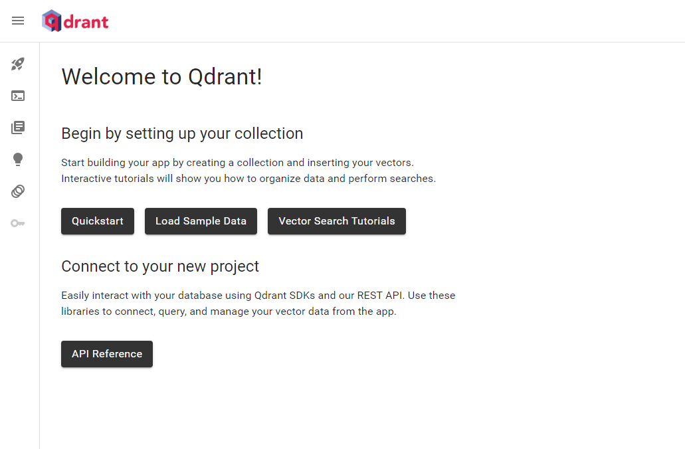
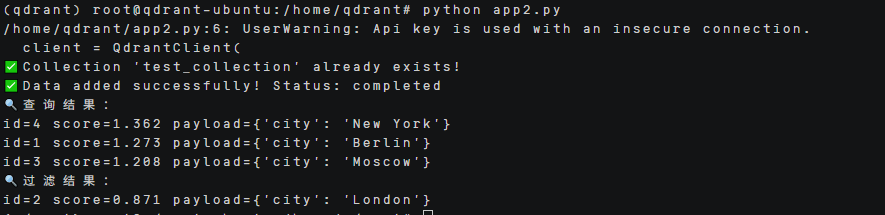

# Qdrant部署指南


## ‌一、环境准备


### 更新系统


#### EulerOS2.0


```
yum -y update  
yum -y upgrade
```


#### Ubuntu 24.04


```
apt-get -y update
export DEBIAN_FRONTEND=noninteractive
apt-get -y -o Dpkg::Options::="--force-confold" dist-upgrade
```


## ‌二、安装docker


#### EulerOS2.0


参考：[安装Docker](https://support.huaweicloud.com/bestpractice-hce/hce_bp_0002.html)

#### Ubuntu 24.04


参考：[安装Docker](https://www.runoob.com/docker/ubuntu-docker-install.html)

## **三、安装conda**


```
mkdir -p ~/miniconda3

wget https://repo.anaconda.com/miniconda/Miniconda3-latest-Linux-aarch64.sh -O ~/miniconda3/miniconda.sh

bash ~/miniconda3/miniconda.sh -b -u -p ~/miniconda3

rm -f ~/miniconda3/miniconda.sh

source ~/miniconda3/bin/activate

conda init --all
```


创建虚拟环境

```
conda create -n qdrant python=3.9
```


## **四、源码下载**


下载源码 git clone https://github.com/qdrant/qdrant.git

安装依赖：

pip install qdrant-client -i https://pypi.tuna.tsinghua.edu.cn/simple

## **五、启动项目**


### **1.修改代码**


新建一个创建数据库应用代码 vim app.py

[app.py](https://github.com/HuaweiCloudDeveloper/qdrant-image/blob/Qdrant-kunpeng/scripts/app.py)

### **2.运行实现**


首先启动qdrant服务：docker run -p 6333:6333 qdrant/qdrant

然后就能打开网页 https:ip:6333/dashboard



运行 python app.py



这个过程主要是创建客户端（与qdrant服务进行交互）、创建集合、添加数据和查询获取结果。


